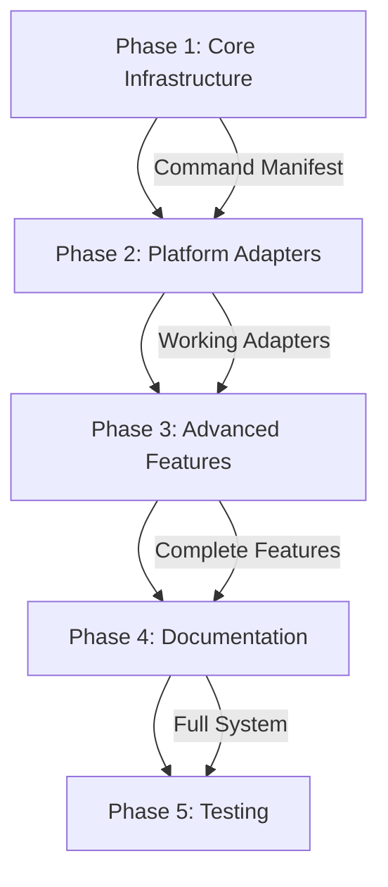

# Unified Shell Integration - Phase Decomposition

## Overview
This document breaks down the unified cross-platform shell integration project into manageable phases. Each phase delivers incremental value while building toward the complete solution.

## Phase 1: Core Infrastructure & Command Manifest
**Duration**: 3 weeks  
**Complexity**: 4/5  
**Dependencies**: None

### Deliverables
1. Command manifest system (JSON-based)
2. Core shell module with shared functions
3. Path normalization utilities
4. Shell detection framework

### Tasks
- [ ] Design JSON schema for command manifest
- [ ] Create command registry from existing slash commands
- [ ] Build core.sh with platform-agnostic functions
- [ ] Implement path normalization (~/. claude standardization)
- [ ] Create shell detection script
- [ ] Build manifest validation tool
- [ ] Design template system for shell generation

### Success Criteria
- [ ] All 30+ slash commands documented in manifest
- [ ] Core functions work in bash, zsh, powershell
- [ ] Shell detection accurately identifies user's shell
- [ ] Path normalization handles all platforms correctly

## Phase 2: Platform Adapters
**Duration**: 2 weeks  
**Complexity**: 3/5  
**Dependencies**: Phase 1 complete

### Deliverables
1. Bash adapter with full command set
2. Zsh adapter with completions
3. PowerShell adapter maintaining current features
4. Installation script updates

### Tasks
- [ ] Generate bash-profile.sh from manifest
- [ ] Generate zsh-profile.sh with completions
- [ ] Refactor powershell-profile.ps1 to use manifest
- [ ] Update install.sh for Unix platforms
- [ ] Update install.ps1 for Windows
- [ ] Create adapter test suite
- [ ] Implement fallback mechanisms

### Success Criteria
- [ ] 100% command parity across all shells
- [ ] Auto-completion works in supported shells
- [ ] Installation detects and configures correct shell
- [ ] Existing features preserved (git commands, etc.)

## Phase 3: Advanced Features & Fish Shell
**Duration**: 2 weeks  
**Complexity**: 3/5  
**Dependencies**: Phase 2 complete

### Deliverables
1. Fish shell support
2. Dynamic command loading
3. Usage tracking cross-platform
4. Auto-update mechanism

### Tasks
- [ ] Create fish shell adapter
- [ ] Implement lazy loading for performance
- [ ] Port ccusage to shell script
- [ ] Build update notification system
- [ ] Create command caching mechanism
- [ ] Add telemetry for feature usage
- [ ] Implement rollback capability

### Success Criteria
- [ ] Fish shell has full command support
- [ ] Shell startup time < 150ms
- [ ] Usage tracking works on all platforms
- [ ] Updates can be applied without reinstall

## Phase 4: Documentation & User Experience
**Duration**: 1 week  
**Complexity**: 2/5  
**Dependencies**: Phase 3 complete

### Deliverables
1. Comprehensive shell integration guide
2. Interactive setup wizard
3. Troubleshooting documentation
4. Migration guide from old system

### Tasks
- [ ] Write SHELL_INTEGRATION.md guide
- [ ] Create interactive setup wizard
- [ ] Document each command with examples
- [ ] Build shell integration diagnostics
- [ ] Create video tutorials
- [ ] Write platform-specific guides
- [ ] Design quick reference card

### Success Criteria
- [ ] Setup takes < 30 seconds
- [ ] Documentation covers all use cases
- [ ] Diagnostics identify common issues
- [ ] Users can migrate seamlessly

## Phase 5: Testing & Optimization
**Duration**: 2-4 weeks  
**Complexity**: 4/5  
**Dependencies**: Phase 4 complete

### Deliverables
1. Comprehensive test suite
2. Performance benchmarks
3. CI/CD integration
4. Production-ready release

### Tasks
- [ ] Create cross-platform test framework
- [ ] Write unit tests for all functions
- [ ] Build integration test suite
- [ ] Performance profiling and optimization
- [ ] Set up CI/CD pipelines
- [ ] Conduct user acceptance testing
- [ ] Create release automation

### Success Criteria
- [ ] 95%+ test coverage
- [ ] All tests pass on mac/linux/windows
- [ ] Shell startup < 100ms optimized
- [ ] Zero regression from current features
- [ ] Automated releases working

## Implementation Order & Dependencies



## Risk Mitigation

### Technical Risks
1. **Cross-platform compatibility**: Mitigate with extensive testing
2. **Performance degradation**: Use lazy loading and caching
3. **Breaking changes**: Maintain backward compatibility layer

### User Adoption Risks
1. **Migration friction**: Provide automated migration tools
2. **Learning curve**: Create interactive tutorials
3. **Platform differences**: Ensure true feature parity

## Success Metrics

1. **Adoption Rate**: 80% of users migrate within 30 days
2. **Performance**: <100ms shell startup time
3. **Reliability**: <0.1% failure rate
4. **Satisfaction**: >4.5/5 user rating
5. **Coverage**: 100% command parity across platforms

## Next Steps

To begin implementation:
```bash
/prd-implement unified-shell-integration phase-1
```

Each phase should be fully completed and tested before moving to the next. The modular design allows for iterative development while maintaining system stability.